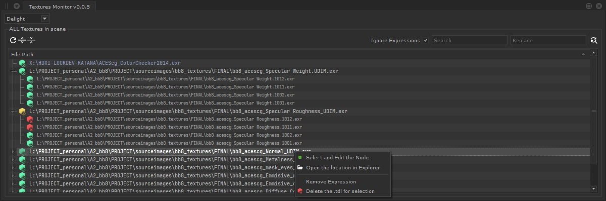

[`index`](index.md) [`getting-started`](getting-started.md) [`features`](features.md) [`developer`](developer.md)

# Katana - Texture Monitor Tool

!!! warning

    This software is deprecated.

Manage Textures easily in your Katana project.

!!! success "Get the app"

    :material-download: Download the app here: <https://gum.co/texmonitor>

## :material-information-outline: About

This tool aim to quickly have a global look at all the texture existing in a Katana project. It also introduce
some convenient feature such as render-engine texture baking, search and replace, ... 

    
## :material-account-group: Contributors

**Development made possible thanks to**

- [ Material Design Icons](https://materialdesignicons.com)
- [JetBrains Mono font](https://www.jetbrains.com/lp/mono/)
- [Thibault Houdon Formations](https://www.docstring.fr/)

**Special Thanks to:**

- [Katana's Discord members](https://discord.gg/Rgn9ucN)
