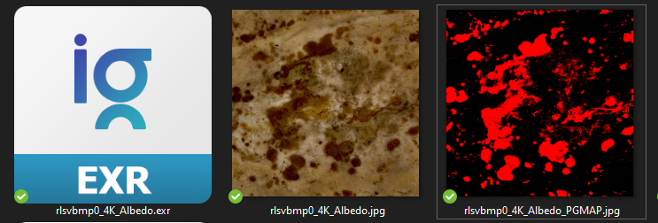

[`home`](index.md) [`getting-started`](getting-started.md) [`features`](features.md)

# Pointer's Gamut Checker Command Line Interface

!!! warning

    This software is deprecated.

!!! info ""

    This tool allow you to check if the gamut of pixels of a given image are in
    the Pointer's Gamut or not.
    
    Or alternatively check if your textures (diffuse reflectance i.e albedo 
    only) are physically correct.

This is a command line tool, it implies no graphical interface to interact
with.
Please refer to [getting-started](getting-started.md) for having an explanation
of how to use it if you never used a CLI.

The output result is an image of the same size as the original with red
pixel representing the out-of-gamut ones, and black for the one in the 
Pointer's Gamut.

!!! success "Get the app"

    :material-download: Download the app here: <https://gum.co/pgtool>

## What is the Pointer's Gamut

The Pointer’s gamut is (an approximation of) the gamut of real surface colors
as can be seen by the human eye,
based on the research by Michael R. Pointer (1980). What this means is that
every color that can be reflected
by the surface of an object of any material is inside the Pointer’s gamut.

Pointer’s gamut is defined for **diffuse reflection** (matte surface)

-- from <https://www.tftcentral.co.uk/articles/pointers_gamut.htm>

> So what that it means for 3d artist ?

That in theory, using the Pointer's Gamut you can tell if your albedo
texture/aov is physically correct.

## :material-account-group: Contributors

**Development made possible thanks to**

- [colour-science python library](https://www.colour-science.org/)
- [Fredrik Averpil's and Sidney Guenther's work](https://github.com/fredrikaverpil/oiio-python)
- [Material Design Icons](https://materialdesignicons.com)
- [OpenImage IO](https://sites.google.com/site/openimageio/home)
- [Thibault Houdon Python Formations](https://www.docstring.fr/)
- [Chris Brejon](https://chrisbrejon.com/) that introduce me the idea of this
  tool and provided me an awesome support and knowledge.

*[CLI]: command line interface