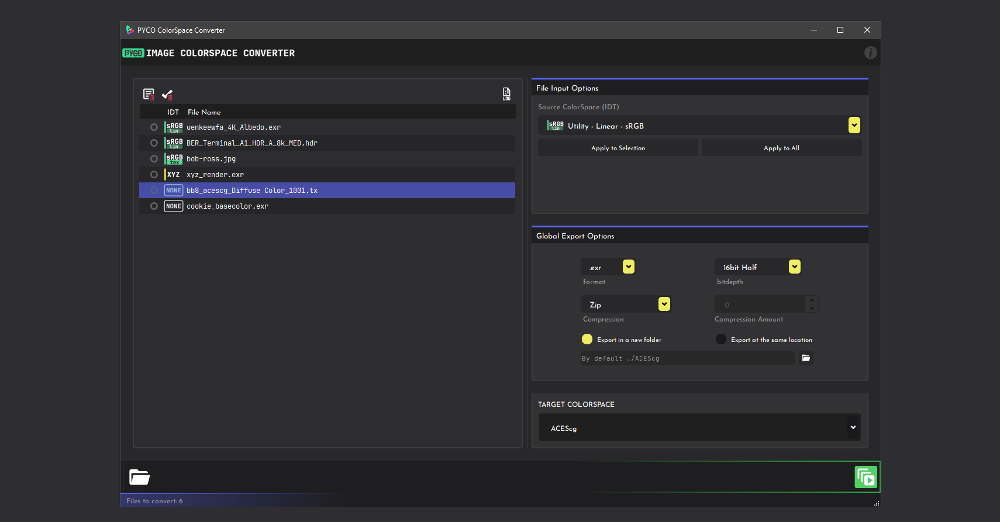

# Home

**Image Colorspace Converter**

Quickly switch colorspaces and file format for your textures, hdris, ...

!!! success "Get the app"
    :material-download: Download the app here: <https://gum.co/pycocs>

## :material-information-outline: About

This utility is targeted at VFX/Animation artists for use in converting input images to a designated target 
color space. It includes export options such as file format, bit-depth, etc.

The app only works with 2d images. 

!!! warning

    No more development support is provided to this application.

!!! bug "Known limitations & bugs"

    * Performance can become very bad with ACES ODTs.
    * Running the app as administrator on Windows will disable drag & drop
    * Converting tiff to png or even using png can cause errors.
    * logging system is actually useless.

    
## :material-account-group: CONTRIBUTORS

**Development made possible thanks to**

- [colour-science python library](https://www.colour-science.org/>) 
- [Fredrik Averpil's and Sidney Guenther's work ](https://github.com/fredrikaverpil/oiio-python)
- [Material Design Icons](https://materialdesignicons.com)
- [OpenImage IO](https://sites.google.com/site/openimageio/home)

**Special Thanks to:**

- Documentation revision:
  [Jørgen Herland](https://www.jorgenhdri.com),
  [kn9](https://www.oddvisionary.studio/),
  [Douglas Bischof](https://www.ceridwenproductions.com/).

- Beta testing:
  [Muhammed Hamed](https://mrlixm.github.io/PYCO/standalone/ColorspaceConvert/home/),
  [Valentin Nicolini](https://mrlixm.github.io/PYCO/standalone/ColorspaceConvert/home/),
  [Jørgen Herland](https://www.jorgenhdri.com),
  [Douglas Bischoff](https://www.ceridwenproductions.com/),  
  [Chris Brejon](https://chrisbrejon.com/).
