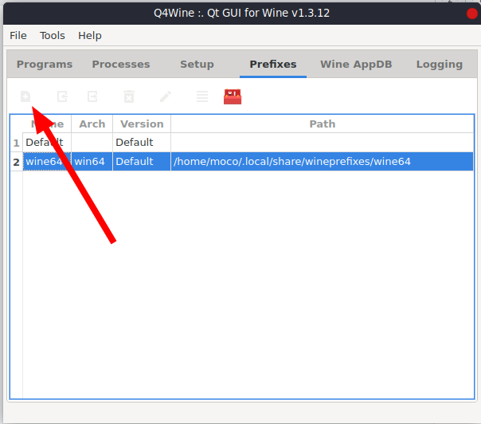
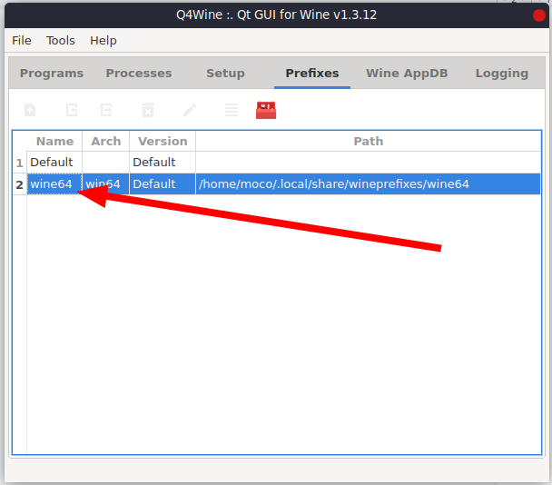
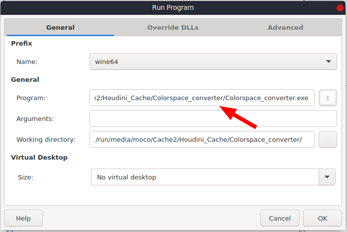

# Running the app on Linux

These explanations were written
by [@RafaelMoco](https://twitter.com/RafaelMoco), huge thanks to him for this.

If you have any question I won't be able to help as i'm not using Linux myself.

## creating the 64bits Prefix

To run PYCO Image Colorspace Converter on Linux, you will need to have the last
version of Wine installed on your computer. After that, you will need to create
a 64bits Prefix, since PYCO Image Colorspace Converter only runs on that
platform. The easiest way to do it is with Q4Wine. For that, just follow these
steps:

On the Prefixes Tab, click on the first menu button

## naming the 64bits Prefix

Now, choose a name for your new prefix. You can put any name, but it's a good
idea to create something easy to identify as your 64 bits prefix, something
like "Wine64". The most important option is Architecture. Here, you need to
choose `win64`. Click Ok

## running the app

To run PYCO Image Colorspace Converter with your new 64Bits Prefix, just click
in File > Run and on the new window, choose the .exe file you want to run in
the Program chooser, and don't forget to choose your 64Bits prefix under the
Name option

Click ok and that's it!

