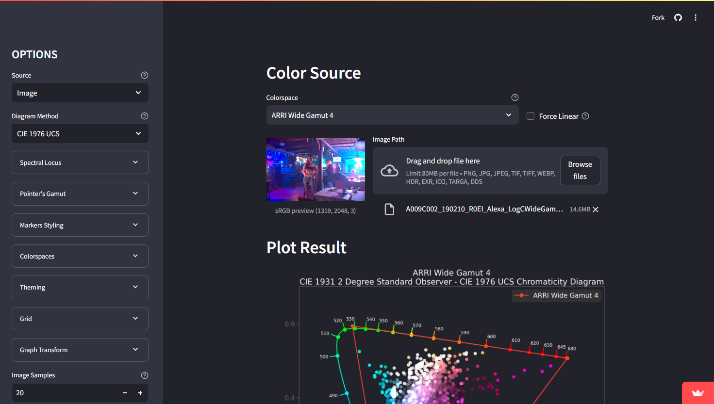

<link rel="stylesheet" href="colour-plotting.css">

# Colour Plotting

Web-app to plot colors, images and colorspaces in graphs.

[Open App](https://colour-plotting.streamlit.app/){.md-button .md-button--primary}

!!! tip "Warning"

    Streamlit (the hosting site) will automatically put the app to sleep if
    it wasn't used by anyone for some time. When that happens you need to awake
    the app by clicking on the suggested button (this can take a minute).

## usage

You can toggle between 2 plotting mode at the top left: `Color` and `Image`.

!!! Warning

    When using images please be cautious with the size of the image you upload. 
    An image that is too heavy risk of crashing the server, especially if a 
    lot of people are using the app (memory is shared).

    You can [contact me](../../about) if the server crash and need a restart.

## reference

The code source can be accessed at <https://github.com/MrLixm/streamlit-colour-plotting>.