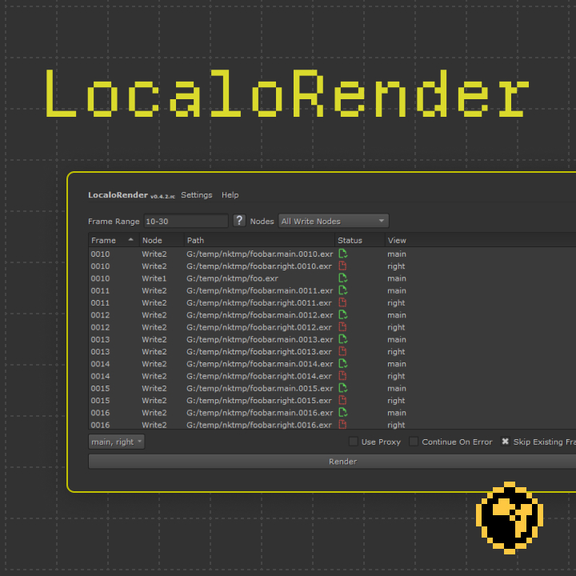
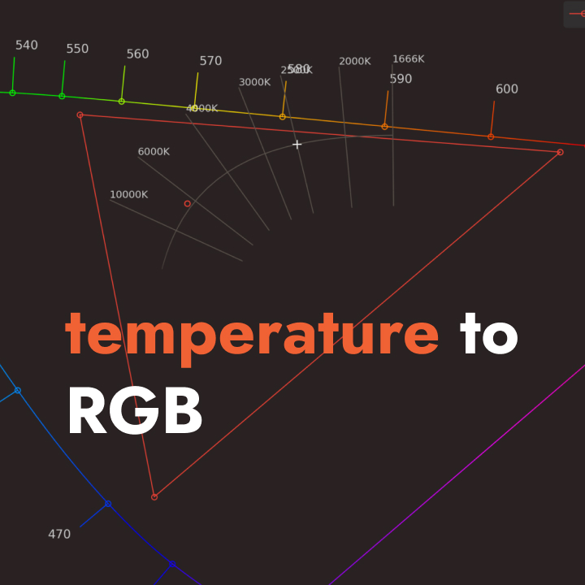
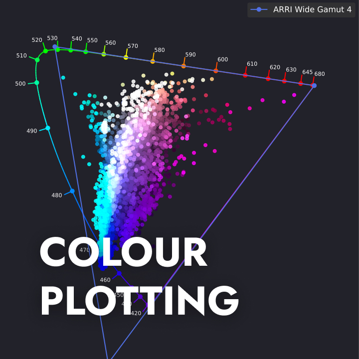

<link rel="stylesheet" href="software.css">

# Software

- 

## web-apps

- 
- 

## Deprecated

| name                                                                   | type           | description                               | last updated |
|------------------------------------------------------------------------|----------------|-------------------------------------------|--------------|
| [Image Colorspace Converter](standalone-colorspace-converter/index.md) | standalone GUI | 2D image colorspace conversion for VFX    | July 2020    |
| [Pointer's Gamut Checker CLI](pointers-gamut-cli/index.md)             | standalone CLI | image colorspace inspection               | Sep 2020     |
| [Katana - Texture Monitor](katana-texture-monitor/index.md)            | Katana Plugin  | browse textures in current katana project | Jan 2021     |

