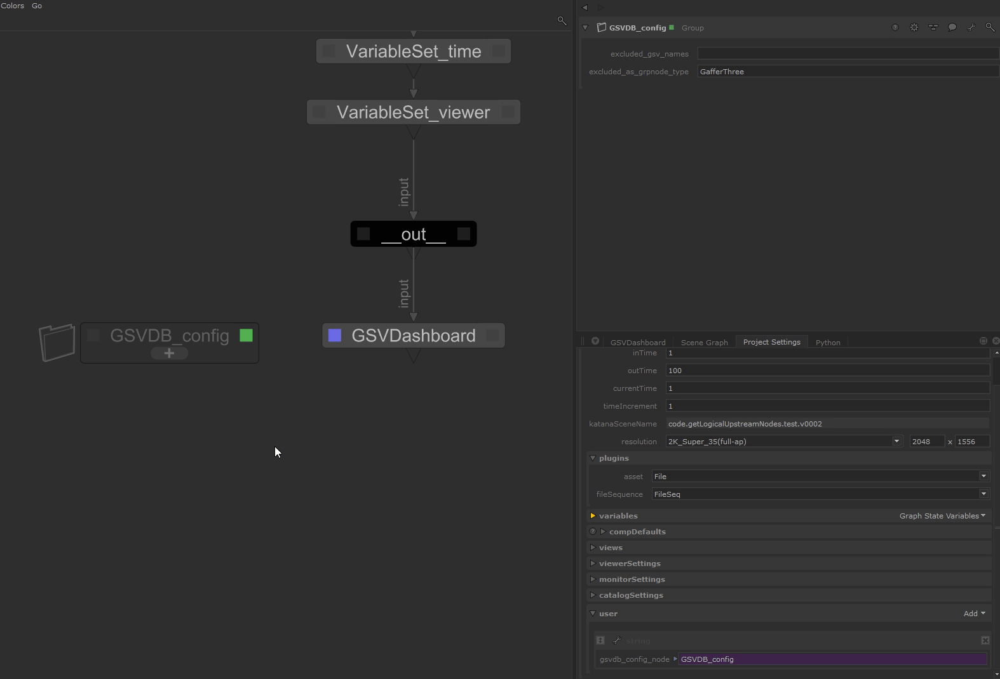

<link rel="stylesheet" href="../../katana-gsvdb.css">

# Configuration

You can configure globally (at scene level) how we parse the nodegraph to find
GSVs.



This configuration is achieved using the katana _User Parameters_ feature. 

| parameter name                    | type | description                                                                    |
|-----------------------------------|------|--------------------------------------------------------------------------------|
| `excluded_gsv_names`              | str  | comma separated list of GSV names to exclude                                   |
| `gsvdb_excluded_gsv_names`        | str  | same as above ^                                                                |
| `excluded_as_grpnode_type`        | str  | comma separated list of nodes that must be parsed as Groups (have child node). |
| `gsvdb_excluded_as_grpnode_type`  | str  | same as above ^                                                                |

Those parameters are expected to be created at following location:

- on a node named exactly `GSVDB_config` at the root of the nodegraph.
- on any node whose name is specified in the `project.user` parameters as :
  ```
  project.user.gsvdb_config_node = "(str) name of the node with the settings"
  ```
- directly by adding them to `project.user`.


## defaults

If no configuration is specified, defaults are :

```python
excluded_gsv_names = ["gaffersate"]
excluded_as_groupnode_type = [
  "GafferThree",
  "Importomatic",
  "LookFileLightAndConstraintActivator",
  "LookFileMultiBake",
  "LookFileManager",
  "NetworkMaterials",
  "ShadingGroup",
]
```