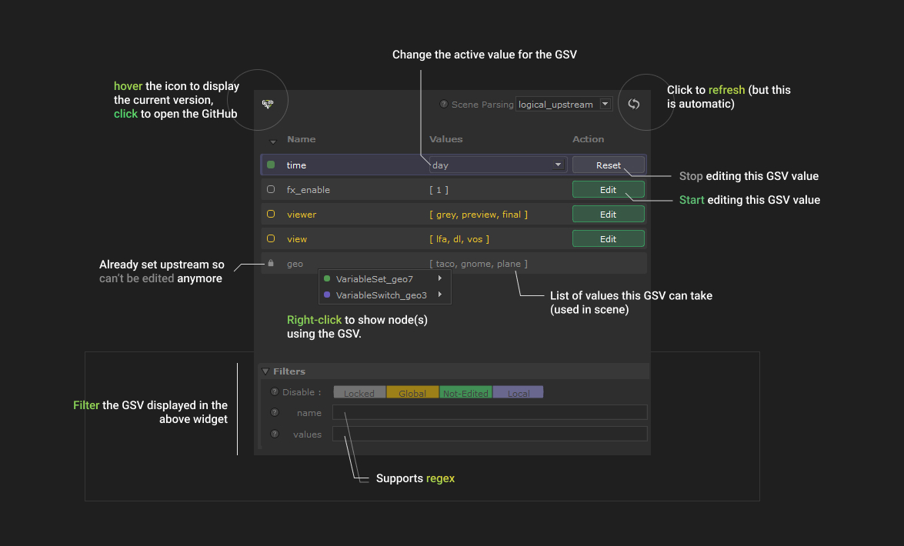
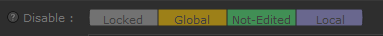

<link rel="stylesheet" href="../../katana-gsvdb.css">

# usage

Once installed, create the node as any other Katana node.

## Reminder about GSVs

- Only the most upstream "setter" node determine which GSV value is being used.
  That's why if a GSV is edited upstream, it became locked. A GSV is
  considered "set" when a `VariableSet` or a `VariableDelete` node is found
  upstream (non-disable).

- If a global GSV is edited locally, the local value override the global value.
  This mean you can't use the "GSV Menu Bar" (at top) anymore for this
  variable.

## Scene parsing widget

Select how the widget will parse the nodegraph to find GSVs.

!!! tip "Warning"

    Make sure the node is always _viewed_ when using `logical_upstream` mode.

## GSV list widget

List all the GSVs found in the nodegraph.

### Editing

When a GSV is edited, a ComboBox widget will appear that will allow you to
choose which value to set for this GSV. For some node like the OpScript node it
is not possible to get the values this GSV can be set to, and as such it's
assumed to be editable with any value, represented by a `*`. In that case the
ComboxBox become editable, and you can delete the `*` to replace it by any
text.

## Filters widget

You can filter the GSV display in the list widget depending on their
characteristics.

### Disable widget

The `Disable` widget filter the GSV by type, for example clicking `Not-Edited`
will filter-out all GSV that are not currently edited by this SuperTool node.

!!! info

    The node is a _capsule_ widget. To set it with an expression you can use a 
    comma separated list of labels like `Locked, Global, Local`

### Name widget

Only display GSV names matching this regular expression.

The expression is formatted in Python's regex. It is evaluated
using `re.search(gsv_name)`.

!!! tip

    If you want to exclude names instead of isolating them, you can use the regex syntax `[^...]`.

    Example: `[^fx_enable][^shading]` will exclude all GSVs names matching `fx_enable`
    and `shading`.

### Values widget

Only display GSV who got at least one value matching this regular expression.

The expression is formatted in Python's regex. It is evaluated
using `re.search(gsv_value)`.

