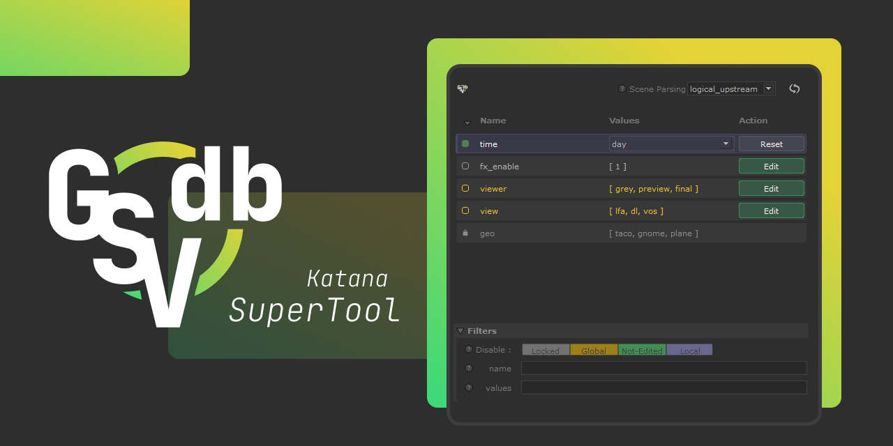
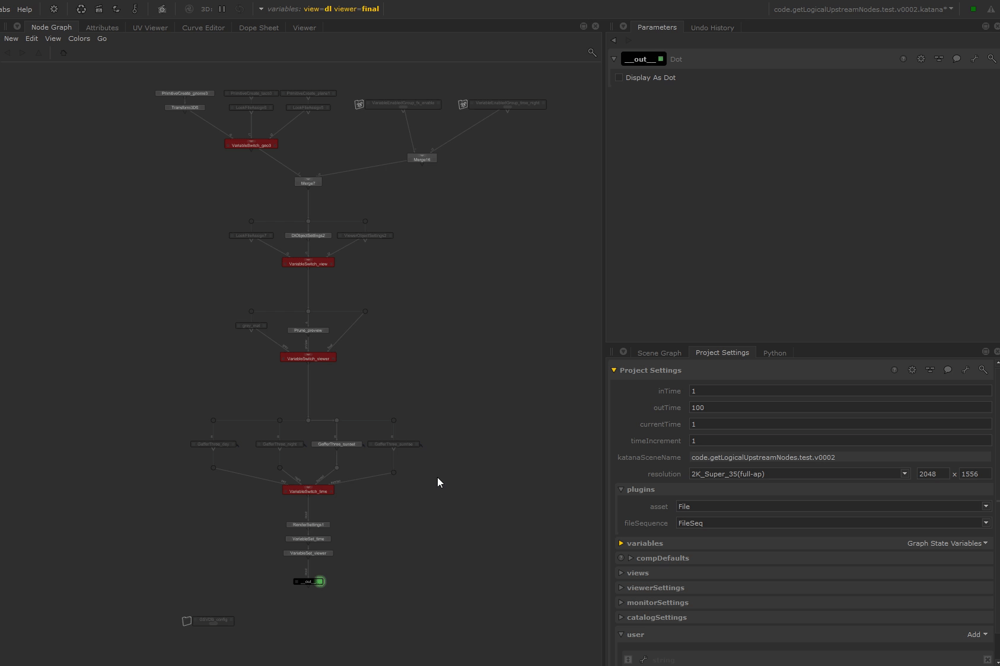

<link rel="stylesheet" href="katana-gsvdb.css">

# GSVDashboard

A Katana Supertool for previewing and editing GSV in the node graph.

[Download & Support :material-hand-heart:](https://pyco.gumroad.com/l/GSVDashboard){ .md-button }
[Download](https://github.com/MrLixm/GSVDashboard){ .md-button }

## features

- :material-target: Local and Global GSVs listing.
- :material-source-fork: Different mode to parse the nodegraph:
    - logical_upsteam
    - upstream
    - all scene
- :material-format-list-checks: listing of the possible value the GSV can take
  as found in the nodegraph.
- :material-playlist-edit: Non-already-edited GSV can be edited using the
  possible values found.
- :material-select-drag: quickly select the nodes using the listed GSVs
- :material-filter: Filter GSV displayed based on type / name / values (with
  regex).
- :material-toolbox: flexible parsing configuration from user parameters

## documentation

[Check Documentation](docs){.md-button}

## demo

{title="middle click to open GIF in a new tab"}
