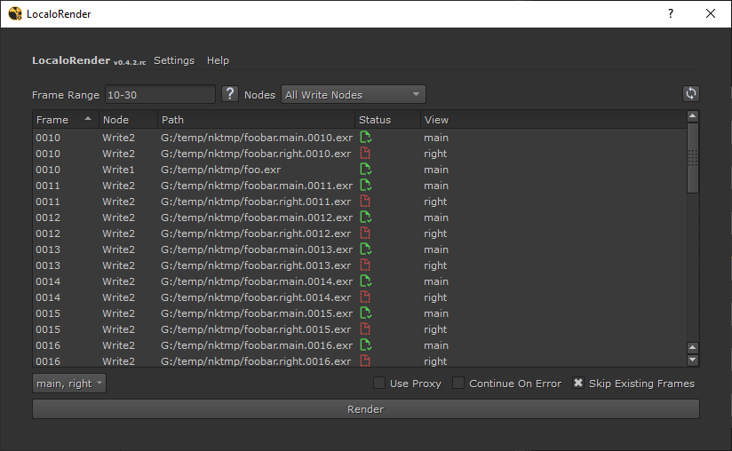

<link rel="stylesheet" href="../../localorender.css">

# Usage

The tool is used pretty much like the native nuke Render Dialog, except that
you now see exactly what file will be rendered on disk.

## path list widget

List all the paths that will be rendered to disk.
**If a path is not listed it will not be rendered**. However, depending on
if you checked the `Skip Existing Frames` option, not all path listed will be
rendered.

## frame range widget

_The top left widget._

The frame range field support the same usual Nuke frame-range syntax. Hover or
click the :material-help: icon to learn about it.

By default the tool will have the frame range set at project level. You can
right click on the frame-range field to see the other presets available.

## nodes widget

_The top middle widget._

Define which Write nodes are going to be rendered. By default it only render
selected Write nodes.

The `This current Write node` is to use when the script is called from a 
Python Knob stored on a Write node.

## views widget

_The bottom left widget._

This widget allow you to **filter** the number of view rendered, if your comp
have multiple views defined. It **cannot** render new views that have not been
set on the Write node.

## settings menu

_Accessible from tool's top menu-bar._

!!! note ""

    Settings save you ui configuration in memory so the tool can remember
    its configuration between sessions.

- **are disabled by default** and need to be enabled if desired.
- only saved when you click the `Render` button or hide/close the tool,
  but you can manually trigger the save by clicking the corresponding option in
  the menu.

If something get corrupted you can:

- use the `Reset Default Settings` option.
- disable the feature totally (check guidelines in the [install](../install)
  doc)