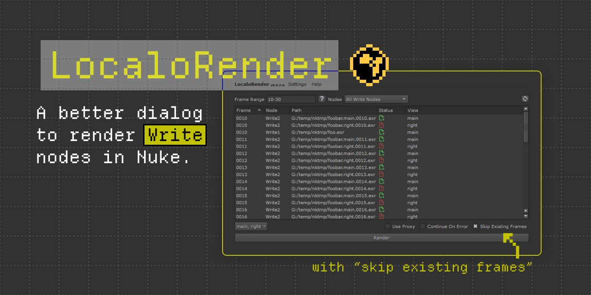

<link rel="stylesheet" href="localorender.css">

# LocaloRender

A Nuke tool to replace the native Render dialog for Write nodes.

[Download & Support :material-hand-heart:](https://pyco.gumroad.com/l/localorender){ .md-button .localo-button- }
[Download](https://github.com/MrLixm/nuke-tools-lxm/tree/main/src/localorender){ .md-button }

## features

- :material-skip-forward: Add "skip existing frames" options.
- :material-eye-settings: Add a view filter menu to restrict the number of view to render, if any.
- :fontawesome-solid-list: Add a widget to visualize all the path that will be rendered.
- :fontawesome-solid-square-share-nodes: Add an option to change which Write nodes are used for rendering.
- :material-form-textbox: Support regular nuke frame-range syntax.
- :material-form-textbox: Supports `#` frame tokens in paths.
- :material-form-textbox: Supports `%...d` frame tokens in paths.
- :material-form-textbox: Supports tcl expression in paths.
- :material-form-textbox: Supports `%V` and `%v` tokens in paths.
- :material-window-restore: Support docking in the regular Nuke interface.
- :material-content-save: Settings system to remember your configuration between sessions.
- :material-download-multiple: Multiple installation methods.

!!! warning "Unsupported"

    - rendering to Background
    - rendering to Frame Server

## documentation

[Check Documentation](docs){.md-button}

## demo

<video controls>
    <source src="imgs/localorender-demo.mp4" type="video/mp4">
</video>