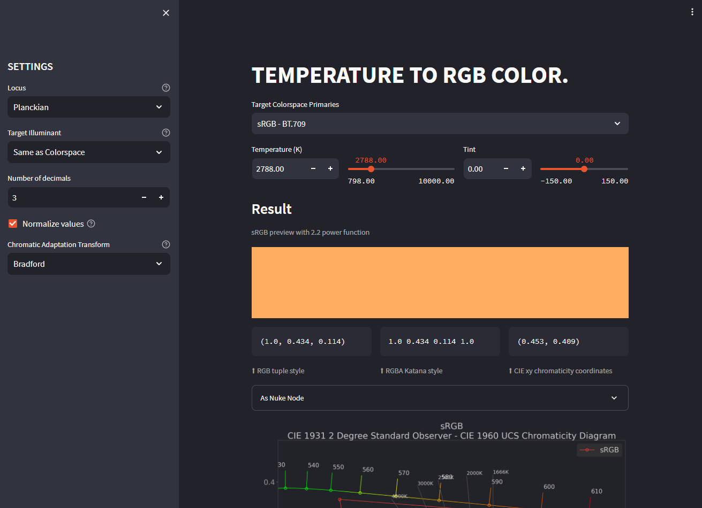

<link rel="stylesheet" href="temperature-to-rgb.css">

# Temperature To RGB

Web-app for converting Kelvin temperature to RGB colorspaces.

[Open App](https://mrlixm-temperature2rgb.streamlit.app/){.md-button .md-button--primary}

!!! warning

    Streamlit (the hosting site) will automatically put the app to sleep if
    it wasn't used by anyone for some time. When that happens you need to awake
    the app by clicking on the suggested button (this can take a minute).

## reference

The code source can be accessed at <https://github.com/MrLixm/Streamlit_Temperature2RGB>.